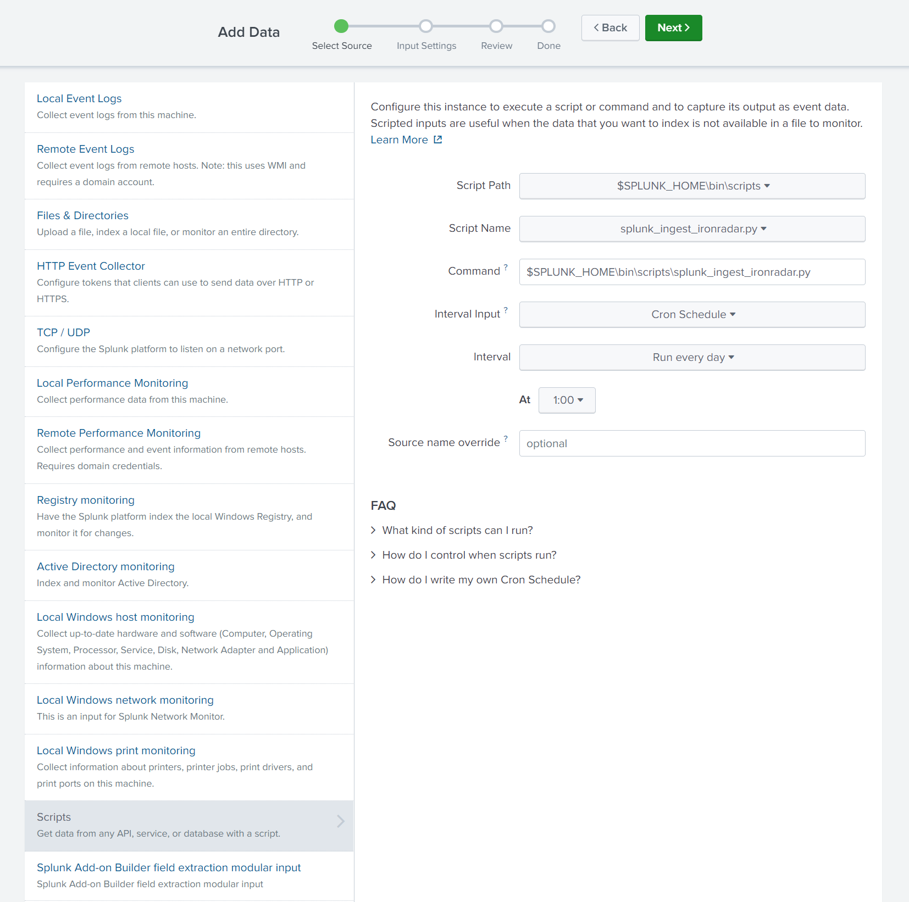
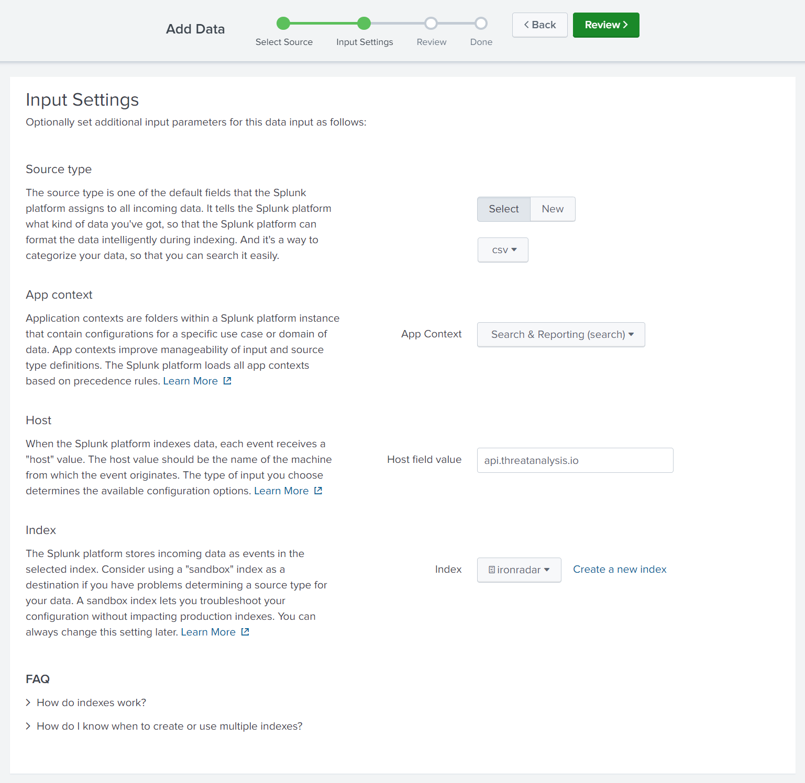
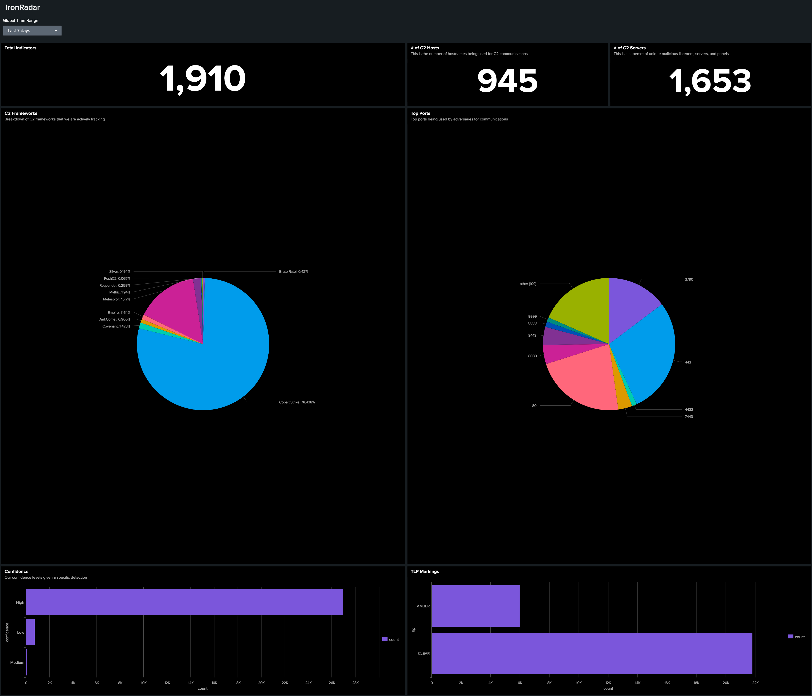

# Splunk Integration

The easiest way to ingest data into splunk, is to take our ingest python script and to add it to your Splunk instance.

## Setup (Ingest via Script)

1. Download [splunk_ingest_ironradar.py](./splunk_files/splunk_ingest_ironradar.py)
2. Open the file, and add your API key to the variable `api_key`
3. Save the file and move the file to `$SPLUNK_HOME\bin\scripts\`
4. Login to your Splunk instance
5. In the top right, click settings, and under 'data' click on 'data inputs'
6. Click on scripts and then in the top right, 'new local script'
7. The following is our recommended settings - set the cron job to run daily in order to ingest our latest indicators:

8. Proceed to the next page by clicking next and follow the settings below. In this step, you can either add our dataset to a current index or create a new index on this page. Our index is called `ironradar`

9. Finally, click review and then submit! Now you can search the data in the index.

## Setup (Manual Upload)
This solution may be useful for customers who want to pull the file locally, and then want to manually upload it to their Splunk instance.

1. Download [ironradar.py](./splunk_files/ironradar.py)
2. Edit the file `ironradar.py` with your API key
3. Open your terminal, change directory to where the file was downloaded, and execute `python ironradar.py`
4. The python script will then download a .csv file with the latest results to the current directory that the script was located in
5. In Splunk, click add data, upload, and then follow the on-screen steps to add the csv
6. Now your data will be in Splunk!

## Dashboard Setup

1. Download the [sample dashboard](./splunk_files/ironradar_dashboard.xml) XML
2. In the Search app, click on dashboards, and create a new dashboard
3. When editing the dashboard, click on edit source, and copy and paste the sample dashboard into this new dashboard

Note: The index we used was `ironradar`, if you ingest the data into a different index, you will need to update the dashboard source code to reflect your index.