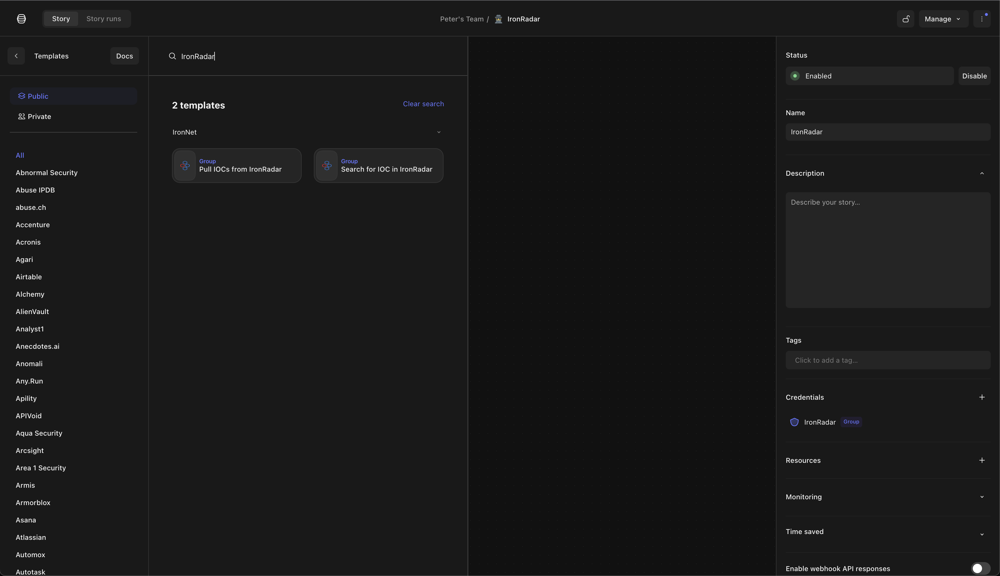
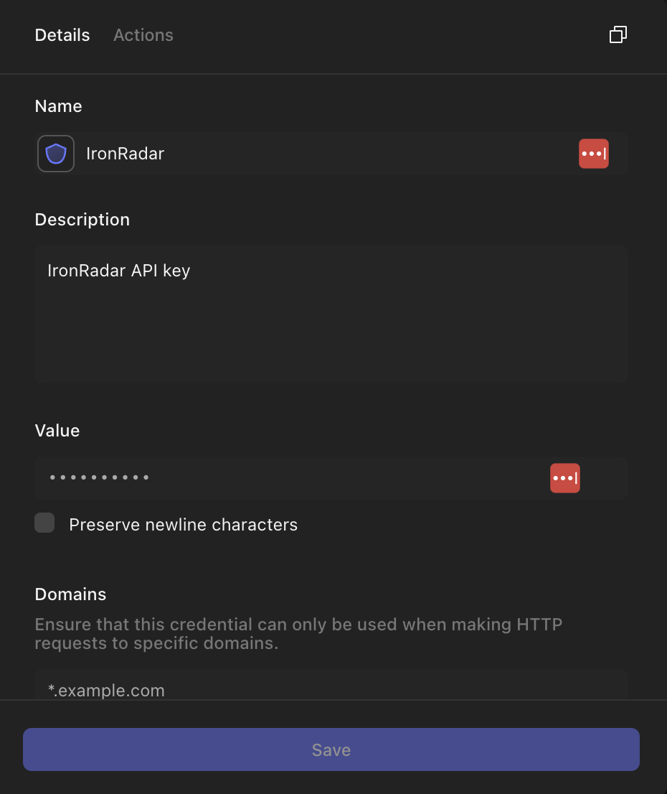

# Tines Integration

## Setup

1. Log in to your Tines tenant and open a Story
2. Browse to the "Templates" section on the left and search for "IronRadar". You will see two integrations available:

- Pull IOCs from IronRadar
- Search for IOC in IronRadar

3. Drag and drop one of the integration groups into your story.

1. You will notice, to interact with the IronRadar API, you will need to add a credential to your Tines tenant called `IronRadar`. This should be set to the value of the API key provided when purchasing access to the service.

